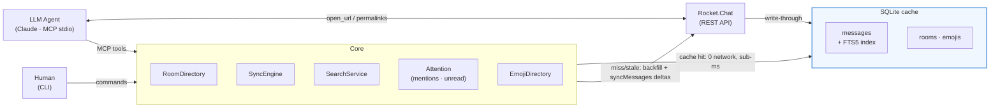

# rocket-cli

Rocket.Chat bridge with a local SQLite/FTS5 cache — CLI for humans, MCP server for LLM agents.

On first read a room is backfilled (up to 500 messages / 30 days). Subsequent reads hit `chat.syncMessages` for deltas (60 s TTL), then serve from SQLite — zero network on cache-fresh rooms. Full-text search runs across all cached rooms locally via FTS5; when scoped to a room it falls back to the server and ingests the results into the cache.



*Architecture at a glance: agents and humans share one Core; the SQLite cache absorbs most reads; the server is only hit on cache miss or write.*

## What needs my attention

The headline feature: one call answers "what did I miss?". `get_attention` (MCP) / `rocket-cli attention` (CLI) fuses mentions of you, unread DMs, unread thread replies, and unread channel messages into a single prioritized, deduplicated digest — a message that both mentions you and is unread appears once, in the mentions section, flagged `alsoUnread`. Every item carries a clickable Rocket.Chat link, and the whole flow is strictly read-only (it never clears a single unread badge). Paste any of those links back to the agent via `open_url` (or `rocket-cli open <url>`) and you get the surrounding conversation plus the ids needed to reply — a full triage-to-reply round-trip without leaving the chat.

## Install

**Requirements**: Node >= 20, `npm`

```sh
git clone <repo-url>   # or your fork/path
cd rocket-cli
npm install
npm run build
npm link               # optional: puts `rocket-cli` on your PATH
```

After `npm link`, examples below can use `rocket-cli` instead of `node dist/cli.js`.

## Get your credentials

1. Open Rocket.Chat in your browser → click your avatar (top-left) → **My Account** → **Personal Access Tokens**
2. If the section is missing: an admin must enable the `API_Enable_Personal_Access_Tokens` setting, and your role needs the `create-personal-access-tokens` permission
3. Name the token (e.g. `rocket-cli`), check **Ignore Two Factor Authentication** (without it, API calls may demand TOTP codes the CLI cannot answer), then click **Add**
4. Copy both the **token** and the **user ID** — they appear together in the same confirmation dialog, and the token is shown only once
5. Copy the example env file and fill in your values:
   ```sh
   cp .env.example .env
   ```
   Set `ROCKETCHAT_URL`, `ROCKETCHAT_TOKEN`, and `ROCKETCHAT_USER_ID`. The CLI auto-loads `.env` from the directory you run it in; real environment variables always take precedence.

## Quickstart

```sh
rocket-cli rooms        # lists rooms you're subscribed to — verifies auth
rocket-cli sync --all   # initial backfill into the local cache
rocket-cli messages general -n 20
rocket-cli search "deploy"
```

Cache reset: `rm ~/.local/share/rocket-cli/cache.db*` — next run re-syncs from the server.

## CLI usage

All commands accept `--json` for machine-readable output.

```sh
# List rooms you belong to
node dist/cli.js rooms
node dist/cli.js rooms --type channel
node dist/cli.js rooms --filter infra

# Sync a room or all rooms
node dist/cli.js sync #dev
node dist/cli.js sync --all
node dist/cli.js sync --all --force   # bypass TTL, re-fetch everything

# Read messages
node dist/cli.js messages #dev -n 50
node dist/cli.js messages #dev -n 20 --before 2026-06-01T00:00:00.000Z

# Show everything unread since you last read each room (read-only — never clears badges)
node dist/cli.js unread
node dist/cli.js unread --limit 20 --no-threads

# One-call triage: mentions + unread DMs + threads + channels, prioritized & deduplicated
node dist/cli.js attention
node dist/cli.js attention --since-days 2 --limit 20 --all-broadcasts

# Just the messages that mention you, across all cached rooms (read-only)
node dist/cli.js mentions
node dist/cli.js mentions --since-days 14 --all-broadcasts

# Show the conversation around a message id (from search, mentions, or a link)
node dist/cli.js context <message-id>
node dist/cli.js context <message-id> --before 20 --after 10

# Paste any Rocket.Chat web link to open its content + how to reply
node dist/cli.js open "https://chat.example.com/channel/general?msg=<id>"

# Full-text search (cross-room by default)
node dist/cli.js search "deploy error"
node dist/cli.js search "deploy error" --room #dev
node dist/cli.js search "deploy error" --room #dev --author jsmith --limit 10

# Send a message
node dist/cli.js send #dev "Hello team"
node dist/cli.js send #dev "Fixed in the next build" --thread <parent-message-id>

# List threads in a room; show a specific thread
node dist/cli.js threads general -n 10
node dist/cli.js thread <parent-message-id>

# Watch for messages matching a query (local FTS)
node dist/cli.js watch "deploy error" --once
node dist/cli.js watch "incident" --room #ops --interval 30

# Upload a file to a room
node dist/cli.js upload general /path/to/report.pdf --text "Q2 report"

# Download an attachment (use the link from `messages` output: [file] name -> /file-upload/…)
node dist/cli.js download /file-upload/abc123/report.pdf --out /tmp/report.pdf

# List custom emojis registered on the server
node dist/cli.js emojis
node dist/cli.js emojis --filter rocket
node dist/cli.js emojis --sync                  # force a refresh, ignore TTL
node dist/cli.js emojis --export /tmp/emoji     # save every emoji image to a directory

# Start the MCP stdio server (used by Claude Code / Claude Desktop)
node dist/cli.js serve
```

### `rooms` flags

| Flag | Description |
|---|---|
| `--type <type>` | Filter by type: `c` / `channel`, `p` / `group`, `d` / `dm` |
| `--filter <substr>` | Case-insensitive name substring filter |

### `sync` flags

| Flag | Description |
|---|---|
| `[room]` | Room name, `#channel`, or id |
| `--all` | Sync every subscribed room sequentially |
| `--force` | Bypass TTL and re-sync even if cache is fresh |

### `messages` flags

| Flag | Description |
|---|---|
| `-n, --count <n>` | Number of messages to show (default 30) |
| `--before <ISO>` | Show messages older than this ISO 8601 timestamp |
| `--include-system` | Include system messages (joins, topic changes, etc.) |

### `unread` flags

Read-only: lists messages with `ts` newer than each room's server-side last-read watermark (the marker the UI sets when you open a room). It never calls `subscriptions.read` and never clears unread badges. Rooms with no read marker fall back to a newest-N approximation, flagged in the output.

| Flag | Description |
|---|---|
| `--limit <n>` | Max messages per room (default 50) |
| `--no-threads` | Skip unread thread replies (threads shown by default) |

### `attention` flags

Read-only one-call triage. Runs the mentions and unread views, then fuses them into prioritized sections — `MENTIONS`, `DIRECT MESSAGES`, `THREADS`, `CHANNELS` — deduplicated by message id (a mentioned message that is also unread is shown once, under mentions, flagged `also unread`). Every item carries a clickable link. Never clears a badge.

| Flag | Description |
|---|---|
| `--since-days <n>` | How far back to look for mentions, in days (default 7) |
| `--limit <n>` | Max items per section (default 30) |
| `--all-broadcasts` | Also include channel-wide @all/@here mentions |

### `mentions` flags

| Flag | Description |
|---|---|
| `--since-days <n>` | How far back to look, in days (default 7) |
| `--limit <n>` | Max total mentions to show (default 50) |
| `--all-broadcasts` | Also include channel-wide @all/@here mentions |

### `context` flags

| Flag | Description |
|---|---|
| `<messageId>` | The message to center the conversation on |
| `--before <n>` | Messages to show before the target (0-50, default 10) |
| `--after <n>` | Messages to show after the target (0-50, default 5) |

### `open` flags

Paste any Rocket.Chat web link — a message, a thread, or a plain channel — and `open` resolves it, prints the surrounding conversation (target marked `→`), and shows how to reply.

| Flag | Description |
|---|---|
| `<url>` | Any Rocket.Chat link: message, thread, or channel |
| `-n, --count <n>` | Number of messages of context to show (default 20) |

### `search` flags

| Flag | Description |
|---|---|
| `--room <r>` | Limit to one room and enable server-side fallback |
| `--author <u>` | Filter by author username |
| `--limit <n>` | Maximum results (default 20) |

### `send` flags

| Flag | Description |
|---|---|
| `--thread <id>` | Reply to the thread with this parent message id |

### `threads` flags

| Flag | Description |
|---|---|
| `-n, --count <n>` | Number of threads to show (default 25) |
| `--text <filter>` | Filter threads by parent message text |

### `thread` flags

| Flag | Description |
|---|---|
| `-n, --count <n>` | Number of replies to show (default 50) |

### `watch` flags

| Flag | Description |
|---|---|
| `--room <r>` | Limit to a specific room (default: all rooms) |
| `--interval <sec>` | Poll interval in seconds (default 60) |
| `--once` | Run a single pass over the last 24 h and exit |
| `--notify <target>` | Post each match to this room or user |
| `--log <path>` | Append matches as JSON lines to a file |

### `upload` flags

| Flag | Description |
|---|---|
| `--text <t>` | Caption message for the attachment |
| `--thread <id>` | Attach inside the thread with this parent message id |
| `--name <n>` | Override the uploaded file name |

### `download` flags

| Flag | Description |
|---|---|
| `--out <path>` | Where to save the file (default: `~/Downloads/<name>`) |

### `emojis` flags

| Flag | Description |
|---|---|
| `--filter <substr>` | Case-insensitive name substring filter |
| `--sync` | Force a refresh, ignoring the cache TTL |
| `--export <dir>` | Fetch and write each emoji image as `<name>.<ext>` to a directory |

Image caching can be disabled with `ROCKET_CLI_EMOJI_IMAGES=false` (metadata only); `--export` and `get_custom_emoji` then degrade to names/aliases plus the server image URL.

## MCP server for Claude Code

Add to `.mcp.json` in your project root (or `~/.claude/mcp.json` for global):

```json
{
  "mcpServers": {
    "rocketchat": {
      "command": "node",
      "args": ["/absolute/path/to/rocket-cli/dist/cli.js", "serve"],
      "env": {
        "ROCKETCHAT_URL": "${ROCKETCHAT_URL}",
        "ROCKETCHAT_TOKEN": "${ROCKETCHAT_TOKEN}",
        "ROCKETCHAT_USER_ID": "${ROCKETCHAT_USER_ID}"
      }
    }
  }
}
```

Use `${VARIABLE}` env-expansion so the token is read from your shell environment, not stored literally in the file. Never commit a `.mcp.json` with a real token.

For Claude Desktop, add an equivalent entry under `mcpServers` in `~/Library/Application Support/Claude/claude_desktop_config.json` (macOS) with the same `command`/`args`/`env` structure.

See `.mcp.json.example` at the repo root for a copy-paste starting point.

**CLI alternative** — register with the `claude` CLI instead of editing `.mcp.json` manually:

```sh
claude mcp add rocketchat \
  -e ROCKETCHAT_URL=https://chat.example.com \
  -e ROCKETCHAT_TOKEN=your-token \
  -e ROCKETCHAT_USER_ID=your-user-id \
  -- node /absolute/path/to/rocket-cli/dist/cli.js serve
```

The `-e` flag sets env vars scoped to this MCP server; they are not exported to your shell. Run `claude mcp add --help` for scope and transport options.

## MCP tools

Seventeen tools are exposed to the LLM agent:

| Tool | What it does | Key inputs |
|---|---|---|
| `list_rooms` | List subscribed channels, groups, and DMs | `filter?`, `type?` (channel/group/dm), `limit?` (default 50) |
| `get_messages` | Read messages from a room, newest first | `room`, `count?` (default 30, max 100), `before?`, `after?` (ISO 8601), `includeSystem?` |
| `get_attention` | One-call triage of everything needing attention — mentions, unread DMs, unread threads, unread channels, prioritized + deduplicated, every item linked (read-only) | `sinceDays?` (default 7, max 90), `limitPerSection?` (default 30, max 100), `includeChannelWide?` (default false) |
| `get_unread` | List everything unread since you last read each room (read-only; never clears badges) | `limitPerRoom?` (default 50, max 100), `includeThreads?` (default true) |
| `get_mentions` | Messages that mention the user (@username) across all cached rooms, each with a link (read-only) | `sinceDays?` (default 7, max 90), `limit?` (default 50, max 100), `includeChannelWide?` (default false) |
| `get_message_context` | Show the conversation around a message id; thread replies pivot to their whole thread | `messageId`, `before?` (0-50, default 10), `after?` (0-50, default 5) |
| `open_url` | Open any pasted Rocket.Chat link (message, thread, or channel) and return its content + the ids needed to reply/react | `url`, `count?` (1-100, default 20) |
| `get_thread_messages` | Read a full thread (parent + replies) | `threadId` (parent message id), `count?` (default 50) |
| `list_threads` | List active threads in a room by last activity | `room`, `count?` (default 25), `text?` (filter parent text) |
| `search_messages` | Full-text search across all cached rooms | `query`, `room?` (scopes + enables server fallback), `author?`, `limit?` (default 20) |
| `send_message` | Post to a room or reply in a thread | `target` (#channel/@user/name/id), `text`, `threadId?` |
| `add_reaction` | Add or remove an emoji reaction on a message | `messageId`, `emoji` (colon-wrapping optional), `remove?` (bool, default false) |
| `get_user_profile` | Look up a user's profile by username or id | `user` (username with or without leading `@`, or user id) |
| `upload_file` | Attach a local file to a room or thread | `room` (#channel/@user/name/id), `filePath` (absolute path), `text?` (caption), `threadId?`, `fileName?` |
| `download_attachment` | Download a message attachment to local disk | `fileUrl` (attachment link after `->`, e.g. `/file-upload/…`), `savePath?` (default: `~/Downloads/<name>`) |
| `list_custom_emojis` | List custom emojis registered on this server (beyond unicode) | `filter?` (name substring) |
| `get_custom_emoji` | Show a custom emoji's image (returns image content) | `name` (with or without colons) |

`get_messages` and `list_threads` return an envelope with `room`, `syncedThrough`, and `coverage` so the agent knows the freshness and depth of the cached data. Thread parents in `get_messages` carry a `replyCount`; pass that message's `id` as `threadId` to `get_thread_messages`.

Attachment links appear in `get_messages` output as `[file] name -> /file-upload/…`; pass the part after `->` as `fileUrl` to `download_attachment`.

## Architecture

1. **Lazy backfill** — first access to a room fetches up to 500 messages / 30 days via `channels.history` / `groups.history` / `im.history`.
2. **Delta sync** — subsequent reads call `chat.syncMessages(lastUpdate)` (60 s TTL), applying edits and deletions into the local store.
3. **FTS5 search** — BM25-ranked full-text search across all cached rooms; if results are thin and a room is specified, falls back to `chat.search` and ingests the server results into the cache.
4. **Write-through sends** — `chat.postMessage` response is upserted into the local DB, so the sent message appears in the next `get_messages` without a sync round-trip.
5. **Threads on demand** — `ensureThreadLoaded` checks `tcount` vs local reply count and backfills gaps via `chat.getThreadMessages`.

**DB location**: `~/.local/share/rocket-cli/cache.db` (XDG data home). Override with `ROCKET_CLI_DB`.

## Server load and rate limits

### How rocket-cli stays gentle by construction

rocket-cli is designed to minimize server pressure:

| Mechanism | Detail |
|---|---|
| Concurrent requests | Global semaphore caps in-flight API calls at **2** at all times |
| Cache-first reads | Repeat reads hit SQLite — zero network. Sync is TTL-gated (default 60 s) |
| Bounded backfills | Initial room backfill is capped at **500 messages / 30 days**, fetched in pages of 100 |
| Late-join rooms | Rooms unsynced longer than the backfill window are re-backfilled in the same bounded pages rather than requesting an unbounded delta from the server's last watermark |
| `watch` polling | Queries the local FTS5 index only — never hits a server-side search endpoint |

### Rocket.Chat's built-in rate limiter

Rocket.Chat applies a per-endpoint, per-IP limit out of the box:

| Setting | Default | Admin path |
|---|---|---|
| `API_Enable_Rate_Limiter_Limit_Calls_Default` | **10 calls / 60 s** | Admin → Settings → Rate Limiter |
| `API_Enable_Rate_Limiter_Limit_Time_Default` | **60 000 ms** | same |

Both values are tunable at runtime without a restart. When rocket-cli receives a **429**, it backs off using the server's own reset signal (`X-RateLimit-Reset` header or `details.seconds` in the error body). Rocket.Chat does not send a `Retry-After` header.

### Important caveat for admin / bot tokens

Accounts that hold the `api-bypass-rate-limit` permission are **not throttled by the server at all**. By default this permission is granted to the **admin**, **bot**, and **app** roles. If you run rocket-cli under an admin Personal Access Token (a common setup), the server-side limiter is effectively off — rocket-cli's own 2-concurrent-request cap is the only brake.

This is fine in practice (see the table above), but worth knowing: the "10 calls/60 s" numbers below do not apply to your session if your token belongs to an admin or bot account.

### Practical throughput numbers

| Token type | First `sync --all` (200 rooms) | Subsequent runs |
|---|---|---|
| Non-admin (default limits, ≈1 room/6 s per endpoint bucket) | ~20 min | Near-instant — cache hit, 0 network |
| Admin / bot (bypass-rate-limit) | Seconds | Near-instant |

After the first sync the cache absorbs routine reads; typical interactive use generates a handful of delta calls per session regardless of token type.

## Environment variables

| Variable | Required | Default | Description |
|---|---|---|---|
| `ROCKETCHAT_URL` | yes | — | Base URL of your Rocket.Chat server (e.g. `https://chat.example.com`) |
| `ROCKETCHAT_TOKEN` | yes | — | Personal Access Token |
| `ROCKETCHAT_USER_ID` | yes | — | Your Rocket.Chat user id |
| `ROCKET_CLI_DB` | no | `~/.local/share/rocket-cli/cache.db` | Override the SQLite database path |
| `ROCKET_CLI_SYNC_TTL_SECONDS` | no | `60` | How long before a cached room is considered stale |
| `ROCKET_CLI_BACKFILL_LIMIT` | no | `500` | Max messages to fetch on initial room backfill |
| `ROCKET_CLI_EMOJI_IMAGES` | no | `true` | Cache custom-emoji image bytes. `false`/`0` caches metadata only (no image fetch/storage) |

## Validating against your own server

rocket-cli's most important features — unread, mentions, threads, DM unreads — only
have meaningful state when *other* users have generated activity for you. Your own
messages never mark your own rooms unread or mention yourself. To exercise the tool
end-to-end you need a realistic multi-user workspace.

Two scripts under `scripts/` do this against any server where you hold an admin PAT:

- **`scripts/seed.ts`** — creates four personas (`ana.dev`, `bruno.qa`, `carla.pm`,
  `diego.ops`), public channels (`#engineering`, `#random`, `#incidents`), a private
  group (`#leadership`), DMs and a multi-party DM to you, then posts a believable
  conversation fabric *as those personas*: threads (incl. one mentioning you and a
  30+ reply long thread), an edited message, a deleted message, an `@all`/`@here`
  broadcast, file + image uploads, a custom-emoji reaction, a quote, rich-text and a
  ~3000-char message, plus **negative** cases that must stay invisible to you (a
  `#secret-ops` channel you are not in, and a persona↔persona DM). It is idempotent:
  re-running checks-before-creating and will not duplicate content.
- **`scripts/validate.ts`** — the automated true-usage test. It runs the built CLI
  with an isolated temp cache (`ROCKET_CLI_DB`), cold-syncs every room, then asserts
  the seeded state surfaces correctly: attention shows the mentions / DM unreads /
  unread thread, `unread` lists the seeded rooms, `mentions` finds 3+, `search`
  hits thread content, `thread` reads the long thread fully, `open` resolves a
  permalink with reply affordances, the edited text is reflected, the deleted message
  is gone, and the negative cases never leak. Each assertion prints a pass/fail line;
  the script exits non-zero on any failure.
  - **Sidebar parity:** on a default-config server (`Unread_Count =
    user_and_group_mentions_only`) a plain-chatter channel sets `alert: true` but
    `unread: 0`; validate asserts such a channel (`#random`, no `@jean` mention) still
    appears in `unread`/attention — flagged `activityOnly` — instead of being dropped.

> [!WARNING]
> **Use a disposable / personal test server only.** `seed.ts` CREATES users and rooms
> and posts messages. Never run it against a production or shared workspace. It reads
> the same `.env` as the CLI and requires the configured account to be an **admin**.

```bash
# requires: a built CLI (npm run build) + admin PAT in .env
npm run seed        # create the multi-user state (idempotent)
npm run validate    # cold-sync into a temp cache and assert everything
npm run validate:full   # both, back to back
```

Persona passwords are generated once and stored in `scripts/.seed-credentials.json`
(gitignored, mode 0600); the path and password are printed to **stderr** only, never
to stdout. The scripts live outside the `src` tsconfig rootDir; typecheck them with
`npx tsc --noEmit --strict --module NodeNext --moduleResolution NodeNext --target ES2022 --skipLibCheck --types node scripts/*.ts`.

## Known issues

See [docs/KNOWN_ISSUES.md](docs/KNOWN_ISSUES.md).
